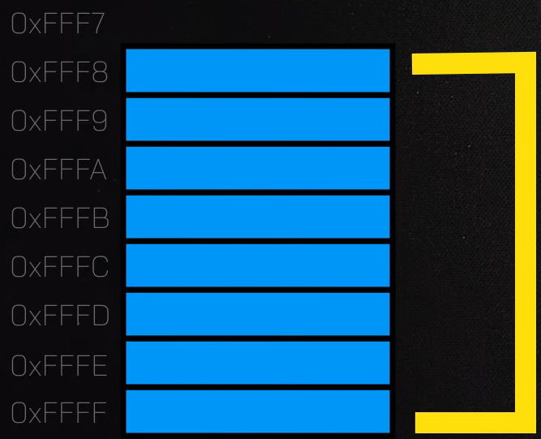
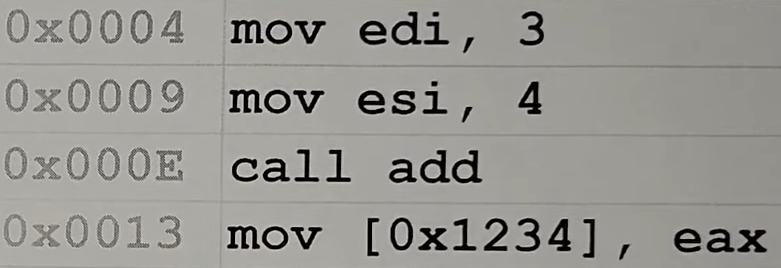
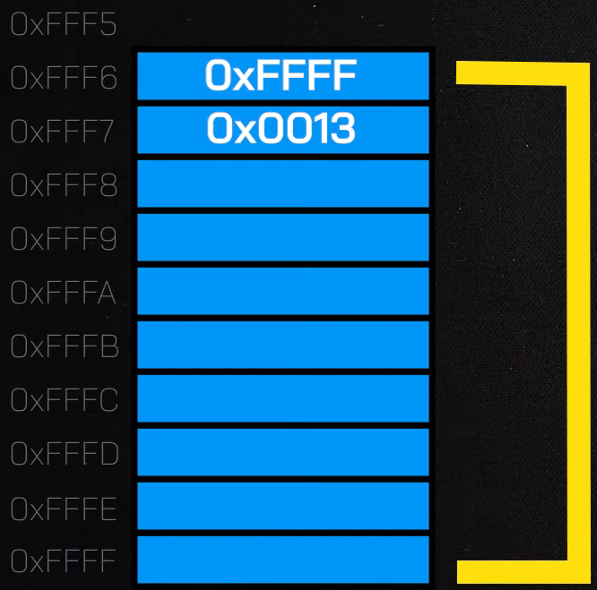
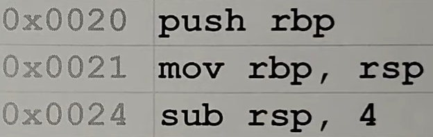
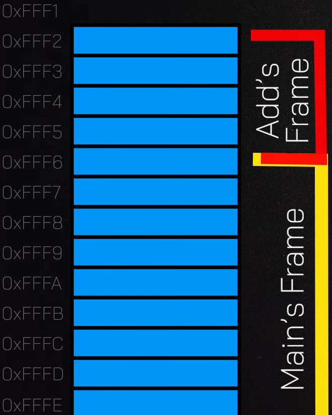
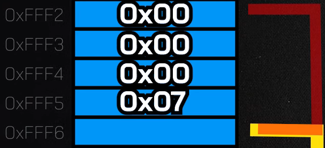
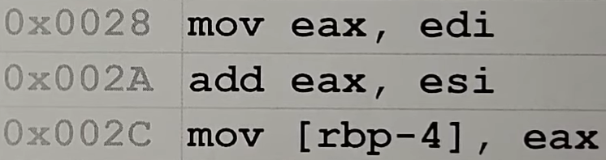
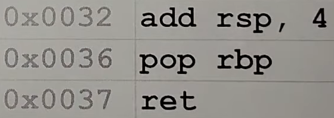
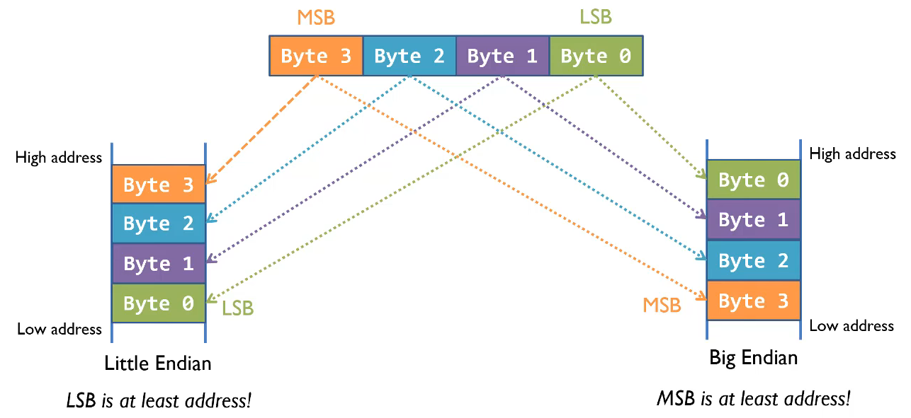

# Day 3: Monday 30 March 2026
## Summary:
I started my research on the Stack and researched the difference between Little and Big Endian.

## Note:
Documentation first, Notes at the bottom.

## Documentation:
I want to spend the following couple of days in pure research instead of practice. Once done, I’ll go back and do practical exercises and tasks with Gemini.

The first thing I wanted to research was the Stack and the Heap! I started with the Stack. During research, I found this amazing [video](https://www.youtube.com/watch?v=u_-oQx_4jvo) that gave me a solid starting knowledge! I also researched memory addresses and Little/Big Endians.

## Notes:
### Topic: Stack

**Definition:**  
I’ll explain the stack in an example first! Imagine a vertical bookshelf, where you place books one by one from the bottom of the shelf to the top of it. If you want to add a book, you need to add it on top. And the top one is the first one to be removed. And the bottom one is the last one to get removed.

This is exactly how a stack works! It is a vertical data structure that follows the LIFO (Last In, First Out) principle. You push (insert) data on the top. And pop (remove) data from the top.

**The Stack is Upside-Down:**  
Each process has its own virtual memory. The virtual memory is the space in RAM the program can use. The address of the sections of the virtual memory starts from the bottom (0) to the maximum at the top (F). From the bottom, there is the code section, then the data section, then the Heap, then a Guard, then the stack. There is a gap between each section (similar to the guard) for safety. So the stack is on top of the virtual memory. If it needs more space, it goes down!

When the size of the stack exceeds the Guard space, the program will encounter a stack overflow! Stack Overflow prevents the stack to take the space of the Heap, Data, and Code sections.

**Stack Frame:**  
Whenever a function is called, a stack frame will be created for it. The stack frame is a block of memory on the single, shared call stack, used to execute the function and store data specific to that function. The data stored in a stack frame typically include the function’s local variables, arguments, and the return address to return to the caller once done.

Since stack frames are inside the stack, they also get treated as the stack works. When a stack frame gets created, it is placed on top of the existing ones. And when the function ends. Its stack frame (the top one) will be removed.

**Stack in Action - Assembly:**  
Imagine that we have 2 functions, the main function, and a function “add” that will be called by the main function. The function “add” takes two arguments named a and b which are numbers. It adds them together, and returns the sum.

Since the main function is executed first, a stack frame will be made to it. To keep track of each stack frame, 2 registers are used: RBP (Register Base Pointer), and RSP (Register Stack Pointer).

RBP used to keep track of the base (the floor / the bottom) of the stack frame. RSP is used to keep track of the top (the the ceiling) of the stack frame. Since stack frames are on top of each other, RSP also knows the top of the whole stack!

So in this case, currently we have the main frame stack. RBP is pointing at 0xFFFF, and RSP is pointing at 0xFFF8 which is the top of both the stack frame and the whole stack.  

  

When main calls the “add” function, the assembly representation of it will look like this.

  
Since “add” is being called, a new stack frame will be created for it. But since the function is going to end at some point, how does the program know where to return? When the call instruction is executed, the first thing it does is to push the next instruction address to the current function’s stack frame. So 0x0013 will be pushed to the main’s stack frame. 

After that, the new stack frame for the function needs to be created. First it pushes RBP to the main’s stack. That way, a new ground is made. Second, the function sets the value of RBP to the value of RSP. That way, the new ground is the ceiling of the main’s stack. Finally, the function subtracts RSP by a specific number of bytes, giving itself the size it needs. With that subtraction, the stack pointer will be at the top of the new stack frame. This process is called the prolog I studied in the Microsoft x64 Calling Convention.

  

Why does subtracting RSP expand the stack instead of shrinking it? This is because as I mentioned earlier, the stack is reversed. So subtracting from memory means expanding the stack (Going down from F to 0).

Now as the function executes, it needs to to take the 2 numbers given to it and add them before returning the result to the main function.

    

The result of the summation is stored in eax. Then from eax to the stack frame. rbp-4 indicates the top of the stack frame of the add function. Since the result is 4 bytes. It takes up all the space of the stack frame. Now why is it written in this way? This is explained in the “Little Endian Vs. Big Endian” Section. Basically it is using Big Endian.

  

Finally, when the function finishes and needs to return. It does the opposite of what it did on calling. Instead of creating a stack frame, now it needs to remove it. To do so, first, it adds the allocated space of the stack frame. So, when it first created the stack frame, it gave itself 4 bytes (sub rsp, 4), now it removes this space (add rsp, 4). Then it pops the base pointer that it added first. At this stage, we are back at RSP pointing at 0xFFF7, and RBP at 0xFFF. Lastly, the ret instruction goes back to the address stored at 0xFF7 which is 0x0013, and removes it from the main’s stack frame. Now, the stack is back to its original shape.

**Memory Addresses:**  
Memory is a very long array of bytes. Each address can only hold 8 bits (1 byte). If we want to store a 4 byte value, we need 4 slots in memory. That’s why the stack sometimes feels that it is “skipping” addresses. For example:
0x000 --> …
0x001 --> …
0x005 --> …
The stack is not skipping addresses. It basically skips “used” addresses. If something takes 4 bytes. The next thing will happen on the 5th byte not the 2nd!

### Topic: Little Endian Vs. Big Endian

When we have a value that is larger than 1 byte (which needs to be put on multiple addresses), the computer has to decide which end of the number to put at the lowest address (the first address). Let’s take this hex value as an example: 0x12345678

**Little Endian:**  
Little Endian is the most common thing used today. It stores the “little end” (the least significant byte) first at the lowest address. So:
- Address 0x100: 78
- Address 0x101: 56
- Address 0x102: 34
- Address 0x103: 12

**Big Endian:**
Big Endian is used in Network Protocols and older Macs. It stores the “big end” (the most significant bit) first at the lowest address. This looks more natural to humans.
- Address 0x100: 12
- Address 0x101: 34
- Address 0x102: 56
- Address 0x103: 78
