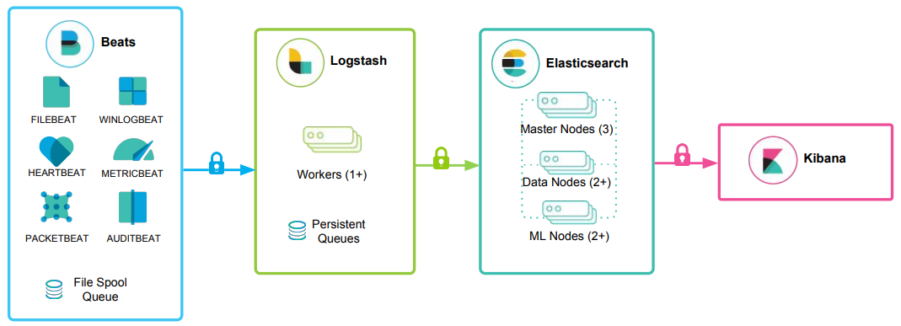

# Roadmap V2 - Day 2: Tuesday 2 June 2026
## Summary:
Summarized what I learned in HTB's SOC Analyst course's Module 2

## Documentation:
### Module 2: Security Monitoring and SIEM Fundamentals
This module provides an in-depth exploration of SIEM systems, details the deployment of the Elastic Stack, breaks down the core architecture of a Modern SOC, and maps out the lifecycle of SIEM Use Case Development and Alert Triaging workflows.

#### **Section 1:** SIEM Definition and Fundamentals
A Security Information and Event Management (SIEM) platform acts as the core bedrock of an enterprise threat management strategy. It combines security data management with real-time event supervision to provide complete network visibility.

**Evolution of the Technology:**  
The term was introduced by Gartner in 2005, merging two distinct legacy technologies:
- **SIM (Security Information Management):** First-generation log management, storage, and compliance reporting.
- **SEM (Security Event Management):** Second-generation real-time event correlation, analysis, and alerting.

**Core Data and Analysis Workflow:**  
Data Ingestion --> Data Normalization --> Correlation Engine --> Action and Visualization

1. **Data Ingestion and Collection:** Massive ingestion pulling terabytes of raw operational data from distributed data sources across the enterprise (PCs, servers, firewalls, network devices, databases, and applications) using platform-specific collection mechanisms.
2. **Data Normalization and Aggregation:** Translating raw, mismatched log formats into a single, structured common language. This prepares the data stream so the correlation engine can read and parse it smoothly.
3. **Analysis and Action:** Running targeted detection logic to cross-reference disparate logs and uncover hidden patterns or anomalies. This populates SIEM consoles, dashboards, visual charts, and real-time alerts.

**Operational Features and Coexistence:**
- **Alert Prioritization:** High-volume logging tracks thousands of events hourly. Precise rule-tuning and risk prioritization are mandatory to target high-risk alerts and prevent alert fatigue.
- **Multichannel Notification:** Dispatches alerts to defensive teams instantly via email, console pop-ups, text messages, or phone calls to minimize adversary dwell time.
- **Complementary Integration:** SIEM does not replace tools like IDS/IPS, firewalls, or EDR solutions; it synthesizes their fragmented logs into a centralized dashboard, giving analysts a holistic view to recognize system exploitation.
- **Compliance Bedrock:** Automatically generates audit-ready compliance reporting to satisfy strict regulatory standards like PCI DSS, HIPAA, and GDPR by providing concrete proof of continuous network surveillance to external regulators.

#### **Section 2:** Introduction to the Elastic Stack

The Elastic Stack is a widely adopted, open-source collection of applications that work together as a powerful SIEM solution to ingest, store, search, and visualize security telemetry.

**1. Beats:**  
Lightweight, single-purpose data shippers installed directly on remote machines. They capture endpoint metrics and log data, forwarding them directly to Logstash or Elasticsearch.

**2. Logstash:**  
The centralized data-processing pipeline component. It collects, standardizes, and enriches data through a three-step cycle:
- **Input:** Ingests log files from remote locations (e.g., flat files, TCP sockets, syslog messages).
- **Filter:** Modifies, transforms, and enriches raw records based on predefined conditions using filter plugins.
- **Output:** Transmits the processed, structured log records to Elasticsearch via output plugins.

**3. Elasticsearch:**  
The heart of the stack. A highly scalable, distributed, JSON-based search and analytics engine built with RESTful APIs. It handles indexing, storing, and executing sophisticated queries on massive datasets.

**4. Kibana:**  
The front-end user interface and visualization portal for Elasticsearch documents. Analysts utilize Kibana to build custom dashboards, parse complex datasets, and run targeted threats searches using the intuitive Kibana Query Language (KQL), which simplifies data extraction compared to raw Elasticsearch Query DSL.

#### **Section 3:** SOC Definition and Fundamentals
A Security Operations Center (SOC) is a centralized team of experts providing 24/7/365 continuous network monitoring, threat detection, and incident containment. The SOC manages daily cybersecurity operations rather than long-term strategic designs.

**Core Workflow:**
1. Monitor
2. Detect
3. Analyze
4. Respond
5. Report

**The Tiered Analyst Hierarchy:**  
Organizations structure their SOC into tiers to properly manage operational workflows and escalation paths:
- **Tier 1 (First Responders):** Continuously monitor live alert streams, execute initial triage, filter out environmental noise/false positives, and escalate validated threats.
- **Tier 2 (Deep Investigators):** Perform deep forensic analysis on escalated incidents, map complex attack paths, design mitigation blueprints, and fine-tune detection tools.
- **Tier 3 (Expert Hunters):** Handle high-priority or complex breaches, conduct proactive threat hunting to uncover hidden adversaries, and build advanced defensive models.

**Specialized Technical and Leadership Roles:**
- **SOC Director and SOC Manager:** The Director sets strategic visions, manages budgets, and aligns security with business risk. The Manager orchestrates daily shift operations and coordinates active incident responses.
- **Detection Engineer:** Authors and updates custom correlation logic, detection signatures, and rules inside SIEM, EDR, and IDS/IPS engines.
- **Incident Responder:** Assumes hands-on command during active breaches to enforce containment, drive forensics, and guide system recovery.
- **Threat Intelligence Analyst:** Researches global cyber threat landscapes and active threat actors to preemptively feed blocks into corporate infrastructure.
- **Security Engineer:** Deploys, maintains, patches, and architecturally scales the hardware and software tools used by the SOC.
- **Compliance Specialist and Training Coordinator:** The Specialist aligns SOC logging operations with regulatory mandates. The Coordinator designs employee awareness programs to limit phishing and social engineering vulnerabilities.

**Evolutionary Generations of the SOC:**  
| Generation |    Focus and Strategy     | Core Technology and Capabilities |
|:----------:|:-------------------------:|:--------------------------------:|
|  SOC 1.0   | Legacy Perimeter Defenses | Disconnected, standalone security layers (Basic firewalls, identity systems). Suffered from uncorrelated alerts and massive backlogs |
|  SOC 2.0   | Comprehensive Situational Awareness | Combines telemetry, network flows, layer-7 application analysis, and threat intel sharing to fight slow-moving, multi-vector attacks |
| Next-Gen / Cognitive | Business Alignment and Continuous Learning | Integrates automated learning models to bridge operational decision gaps. Directly aligns detection logic with specific business processes |

#### **Section 4:** MITRE ATT&CK Framework Integration
The MITRE ATT&CK Framework maps adversary Goals (Tactics) directly to their operational Methods (Techniques and Sub-techniques).

**Operational Use Cases in the SOC:**
- **Behavioral Analytics:** SOCs map framework matrices to system behaviors to write targeted detection rules focused on attacker methodologies rather than brittle static indicators (like IP addresses or file hashes).
- **Gap Analysis and Defense Evaluation:** Teams cross-reference existing security controls against the matrix to identify blind spots, helping leadership optimize budgets and prioritize new security tools.
- **Unified Language and Intel Enrichment:** Standardizes terminology across red teams, blue teams, and external stakeholders, while enriching raw data by linking indicators (IOCs) directly to attacker goals.
- **Defensive Simulations:** Red teams replicate specific matrix behaviors to benchmark live defensive capabilities during realistic penetration testing.

#### **Section 5:** SIEM Use Case Development
A SIEM Use Case is a pre-defined monitoring scenario engineered to group isolated log activities (e.g., 10 failed login attempts across multiple systems) into a single, actionable security alert (e.g., "Brute Force Attack").

**The Development Lifecycle:**
1. **Requirements:** Clearly define the detection objective and triggers (e.g., flagging 10 failed logins within 4 minutes). Ideas are collected from threat intel, analysts, or clients.
2. **Data Points:** Map every required data source (OS logs, VPNs, web applications) and verify that key fields (username, timestamp, source/destination IPs) are present.
3. **Log Validation:** Audit the pipeline to ensure that live logs are reaching the SIEM and formatting correctly during real-world authentication events.
4. **Design and Implementation:** Write the correlation logic using three core parameters:
    - **Condition:** The precise threshold or criteria that triggers the rule.
    - **Aggregation:** Grouping data points logically to minimize alert fatigue.
    - **Priority:** Factoring in context (e.g., assigning a higher severity if the target user holds domain admin rights).
5. **Documentation:** Write detailed Standard Operating Procedures (SOPs) outlining the alert logic, investigative steps, escalation matrices, and contact paths.
6. **Onboarding:** Deploy the use case in a development/testing environment first to tune out false positives before promoting it to production.
7. **Periodic Fine-Tuning:** Continually collect analyst feedback to update whitelists and adapt rules to changing network architectures.

**Metrics and Governance:** Effective use case deployment relies on tracking key performance metrics like Time to Detection (TTD) and Time to Response (TTR), governed by structured Service Level Agreements (SLAs) and Operational Level Agreements (OLAs) between operational units.

#### **Section 6:** The Alert Triaging Process
Alert Triaging is the systematic parsing and prioritization of incoming security alerts to isolate authentic threat incidents from environmental noise.

**The Ideal Triaging Workflow:**
1. **Initial Alert Review:** Examine metadata (timestamps, rule triggers, IP scopes) and analyze raw system/application logs to establish immediate context.
2. **Classification and Correlation:** Categorize severity against the corporate risk matrix and cross-reference the alert with historical events, active indicators (IOCs), and threat intelligence feeds to spot broader attack patterns.
3. **Data Enrichment:** Collect deeper technical artifacts (such as packet captures (PCAPs), memory dumps, or file hashes) and run suspicious components through automated malware sandboxes while checking endpoints for rogue processes.
4. **Risk and Contextual Assessment:** Evaluate the value of the targeted asset, data sensitivity, and potential for lateral movement, while checking if security controls failed or were evaded.
5. **IT Operations Consultation:** Coordinate with infrastructure teams to rule out scheduled system maintenance, authorized network adjustments, or known misconfigurations that could have triggered a false positive.
6. **Response Execution and Incident Activation:** Close the alert if it is proven to be benign. If verified as a true positive, immediately trigger the formal Incident Response Plan (IRP).
7. **Escalation:** When critical boundaries are crossed (e.g., compromise of business-critical systems, insider threats), package the enriched data and pass it to senior management or specialized IR teams. Escalate to external entities (CERTs, law enforcement) if legally required.
8. **Continuous Monitoring and De-escalation:** Maintain real-time telemetry updates with escalated units. Once the threat is successfully contained, eradicated, and stabilized, formally step down the incident response posture, share the final outcome report, and archive lessons learned.