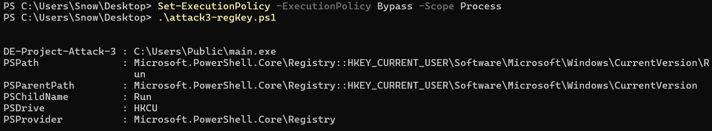
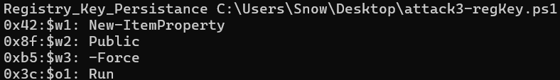
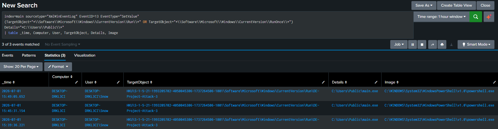

# Roadmap V3 - Documentation 8: Wednesday 1 July 2026
## Summary:
Executed Week 1's Seconday Iteration (which is the 3rd iteration in general) of the Detection Engineering Project which was about Registry Run Keys Persistance attacks!

## Documentation:
The second attack for this week is Registry Run Keys attacks. After researching, I learned that there are 2 Registry Keys targeted by attackers:
- Run: Programs listed in this key run every time the machine boots.
- RunOnce: Programs listed in this key run exactly once and then Windows deletes them.

For attacks that need persistence, the Run key is often targeted!

In addition, there are 2 versions of this:
- Current User
- Local Machine
If the malware was listed in the Run key for Current User (HKCU), the malware will only run on each boot if that specific user logged in. If it was listed under Local Machine (HKLM), then it will always run whoever the logged in user is.

Putting the malware under HKCU needs normal user privilege so it's easier to put here unlike HKLM which needs admin privileges, so attackers need to establish privilege escalation first before doing so.


After researching on how to do the attack, I found that it can also be done by using normal Windows tools using PowerShell! For this iteration, I'll place my main.exe program (the one I used with Iteration 1 - Process Injection) under HKCU (since there are no other users in this lab).

PowerShell Script:
```ps1
$RegPath = "HKCU:\Software\Microsoft\Windows\CurrentVersion\Run"
New-ItemProperty -Path $RegPath -Name "DE-Project-Attack-3" -Value "C:\Users\Public\main.exe" -PropertyType String -Force
```

In the first line, we're getting the full path to reach the Run registry key and assign it to the RegPath variable.

In the second line, we're using the New-ItemProperty cmdlet, which is a native PowerShell cmdlet used to create a new value (which is called property) inside an existing registry key (which is called item). To create this new value, we need to specify the path (which we stored in RegPath), a name to this new value, and the value itself (which will be main.exe)! Since we wrote the value as a string, we need to set -PropertyType to string! Finally, -Force forces this value to be added, so if a value with the name "DE-Project-Attack-3" already exists, it will get overwritten by this new value!

I executed this command:
```ps1
Set-ExecutionPolicy -ExecutionPolicy Bypass -Scope Process
```


Then ran the script, and it successfully!

<br><br><br>

Now, it's time to make the detections! Starting with YARA rules.

This is a bit tricky since again, we're using real native Windows tools! But I think two things stand out which are the Public folder, and -Force. This is because first, I've learned through these iterations that the Public folder is used often by attackers. And second, I don't think staff at a company will use the -Force keyword! if they executed a similar command without Force and they find that this value already exists, they should review it, I don't think they'll use the -Force one (well, maybe after they review it and see that there is no need for the existing one, they'll use -Force to overwrite it, maybe!)! While attackers need to use -Force since what I've learned through these iterations too is that they will name their stuff to sound normal and legit, so they might name the value as a real name a company might already have!

So what I'm thinking of, is that if I catch all 3 keywords together:
- New-ItemProperty
- Public
- -Force
And maybe Run/RunOnce too, I flag the script! So here's what I'm going to apply for the rule: All these 3 keywords, and (Run OR RunOnce)!

YARA Rule:
```yar
rule Registry_Key_Persistance_attack
{
	meta:
		description = "Detects when a script is trying to assign a new value to the Run or RunOnce Registry Key"
		date = "01-07-2026"
		severity = "High"

	strings:
		// Keywords:
		$w1 = "New-ItemProperty" nocase ascii wide
		$w2 = "Public" nocase ascii wide
		$w3 = "-Force" nocase ascii wide

		// Optional
		$o1 = "Run" nocase ascii wide
		$o2 = "RunOnce" nocase ascii wide
	
	condition:
		$w1 and $w2 and $w3 and ($o1 or $o2)
}
```


And this is the result of the rule:

<br><br>

Now, the Sigma rules. I ran the attack again to see what events got generated and I noticed only 1 which contained these data:
```xml
<EventID>13</EventID>
<EventData>
	<Data Name='RuleName'>T1060,RunKey</Data>
	<Data Name='EventType'>SetValue</Data>
	<Data Name='Image'>C:\WINDOWS\System32\WindowsPowerShell\v1.0\powershell.exe</Data>
	<Data Name='TargetObject'>HKU\S-1-5-21-1993205702-4050045306-1737264506-1001\Software\Microsoft\Windows\CurrentVersion\Run\DE-Project-Attack-3</Data>
	<Data Name='Details'>C:\Users\Public\main.exe</Data>
	<Data Name='User'>DESKTOP-DRKL3CI\Snow</Data>
</EventData>
```
We can see the full image from this:
- Event ID 13 was triggered
- Run Key was accessed
- Set Value was triggered
- PowerShell.exe made all this
- DE-Project-Attack-3 was the name of the value
- main.exe was put
- And the user is specified!

So for the rule, of course I'll target Event ID 13! But for the conditions, I'll target when the Image PowerShell, and when the "Run" (or "RunOnce") key and "Set Value" function were there, and if the value came from the Public folder!

Sigma Rule:
```yml
title: Registry Key Persistence Attack
description: Detects when PowerShell triggers the "Set Value" function for the "Run" Registry Key, and assigns something from the "Public" folder in it!
date: 01/07/2026
logsource:
  product: windows
  service: sysmon
detection:
  selection:
    EventID: 13
    EventType: SetValue
    TargetObject|contains:
      - '\Software\Microsoft\Windows\CurrentVersion\Run\'
      - '\Software\Microsoft\Windows\CurrentVersion\RunOnce\'
    Details|contains: 'C:\Users\Public\'
  condition: selection
level: high
```

With that, everything is complete!

But there is one more thing I want to do! I've been having a problem since the start of this whole project, which is to make the translated SPL Queries from the Sigma rules work because they don't! They always return 0 results! So what I was doing so far is giving the sigma rule and and the translation to Gemini, tell it that it doesn't work and "I don't know what's the problem specifically but I guess it's because the XML.." since for example, today's Sigma rule translates to this (maybe):
```spl
index=main sourcetype="XmlWinEventLog:Sysmon" EventID=13 EventType="SetValue"
(TargetObject="*\\Software\\Microsoft\\Windows\\CurrentVersion\\Run\\*" OR TargetObject="*\\Software\\Microsoft\\Windows\\CurrentVersion\\RunOnce\\*") 
Details="*C:\\Users\\Public\\*"
| table _time, Computer, User, TargetObject, Details, Image
```

But I don't have EventID=13 in my events, instead, I have `<EventID>13</EventID>`! And then Gemini gives me a new SPL to work with my Splunk! Which for example, this is what it gave me as an alternative for today's work:
```spl
index=main sourcetype="XmlWinEventLog:Sysmon" "<EventID>13</EventID>" "<Data Name='EventType'>SetValue</Data>" "*\\Software\\Microsoft\\Windows\\CurrentVersion\\Run\\*" "*C:\\Users\\Public\\*"
```

And it worked, it returned 3 events which are exactly the amount of times I ran the attack!

But I want to fix this problem today! So after searching and asking Gemini, it turned out that there is an Add-on for Splunk for Windows that I need to add!

So I downloaded it from [here](https://splunkbase.splunk.com/app/742), uploaded it to Splunk Apps and checked the "Upgrade App" checkbox, then restarted Splunk!

After that, I tested the SPL query again but unfortunately, it didn't work! I tried the alternative, and it worked! So I don't think the problem got fixed!

I searched more and found that I need to change the sourcetype in the "inputs.conf" file for the Universal Forwarder from "XmlWinEventLog:Sysmon" to "XmlWinEventLog:Microsoft-Windows-Sysmon/Operational". So I did that, restarted the forwarder, ran the attack again to make new logs, then tried the SPL query again! Nothing worked again!! I even tried general searches like: "index=main sourcetype="XmlWinEventLog:Microsoft-Windows-Sysmon/Operational"" And also returned 0 events!

At this point, I went to check if Sysmon is active at all or not! So I ran "Get-Service -Name "Sysmon*"" And got Sysmon64 Running. Then I checked if the events were getting logged in the Events Viewer under Sysmon Operational, and they were! So the problem was from Splunk searching! After reporting to Gemini, it recommended to search globally for the attack event by running:"index=* "DE-Project-Attack-3"" And I found them! But weirdly, The sourcetype of the latest events were "sourcetype = XmlWinEventLog"! So it turned out that I was using the wrong sourcetype name!

After that, I ran: "index=main sourcetype="XmlWinEventLog" "DE-Project-Attack-3"" And it worked! Now that I confirmed the new sourcetype name, I tested this search: "index=main sourcetype="XmlWinEventLog" EventID=13" And it also worked! So I tested this new full SPL Query:
```spl
index=main sourcetype="XmlWinEventLog" EventID=13 EventType="SetValue" 
(TargetObject="*\\Software\\Microsoft\\Windows\\CurrentVersion\\Run\\*" OR TargetObject="*\\Software\\Microsoft\\Windows\\CurrentVersion\\RunOnce\\*") 
Details="*C:\\Users\\Public\\*"
| table _time, Computer, User, TargetObject, Details
```



And it actually worked fully! With that, I can say that this problem is finally over!

**Reflections:**  
I enjoyed doing this iteration a lot! I've learned new concepts, especially the SPL Query troubleshooting stuff, learned a lot from it, and I'm happy that the struggle is finally over!